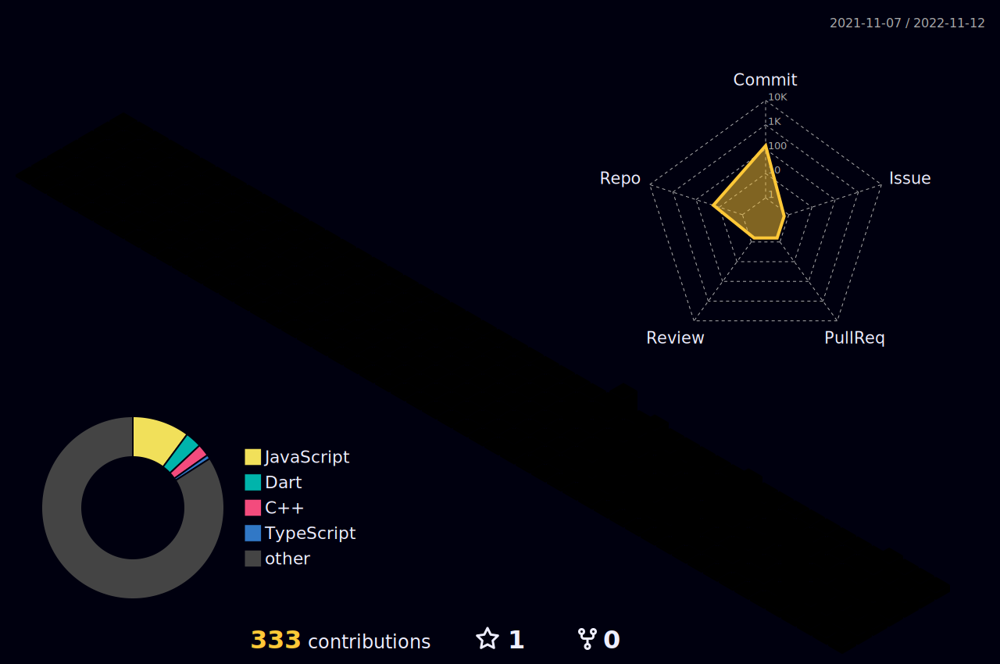

<body>
  

    <h1> Hi there, I'm Jeziel Junior👋<a href="#"></h1>
  

### I'm a Front-end Developer!

- 🔭 I am currently working as a Fron-end developer.
- 🌱 I am currently expanding my knowledge on TailwindCSS and Storybook.

<h2>Tech Stack</h2>

<table width="80%">
<tr>
    <td align='center' width="200">
      
    </td>

  <td align='center' width="200">
        
    </td>
 <td align='center' width="200">
        
    </td>
 <td align='center' width="200">
        
    </td>
 <td align='center' width="200">
        
    </td>
 
</tr>
 
<tr>
    <td align='center' width="200">
        
    </td>
    <td align='center' width="200">
        
    </td>
    <td align='center' width="200">
        
    </td>
    <td align='center' width="200">
        
    </td>
</tr>
 
</table>
	  

 

 
 
|Stats />|Streak />|Languages />
|---|---|---|
||||
 
	
## Personal Projects

| Project :octocat:                                                                | Issues :bug:                                                                                                                                                                             | Open PRs :bell:                                                                                                                                                             | Closed PRs :fire:                                                                                                                                                                                                       | Last Commit 🚩                                                                                                                                                                                      |
| -------------------------------------------------------------------------------- | ---------------------------------------------------------------------------------------------------------------------------------------------------------------------------------------- | --------------------------------------------------------------------------------------------------------------------------------------------------------------------------- | ----------------------------------------------------------------------------------------------------------------------------------------------------------------------------------------------------------------------- | --------------------------------------------------------------------------------------------------------------------------------------------------------------------------------------------------- |
| [**Github Profile**](https://github.com/jeziel-jr/transcript_summary)    |        |        |      |        |
| [**Trivia Challenge**](https://github.com/jeziel-jr/trivia-challenge)                   |                        |                        |                        |                        |
| [**PingTools**](https://github.com/jeziel-jr/pingtools) |  |  |  |  |
| [**Ignite Timer**](https://github.com/jeziel-jr/ignite-timer)                  |                            |                            |                            | |

## ⚡️Github Contributions
	
<h4 align="center">Isometric view of contributions in the last year</h4>

	

## 🚀Github Metrics

	

	
## 🐛Github Magic Game

  

 

 
  Views 
  

